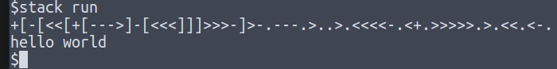

# Brainfuck interpreter

This is a parser and interpreter for the esolang [Brainfuck](https://en.wikipedia.org/wiki/Brainfuck). It is written in Haskell, a purely functional language.

The parser is an applicative parser built from scratch. It implements a subset of the behaviour of other parsers such as Parsec. 

Build system is Stack.

Unit tests use Hspec.

##Example:

